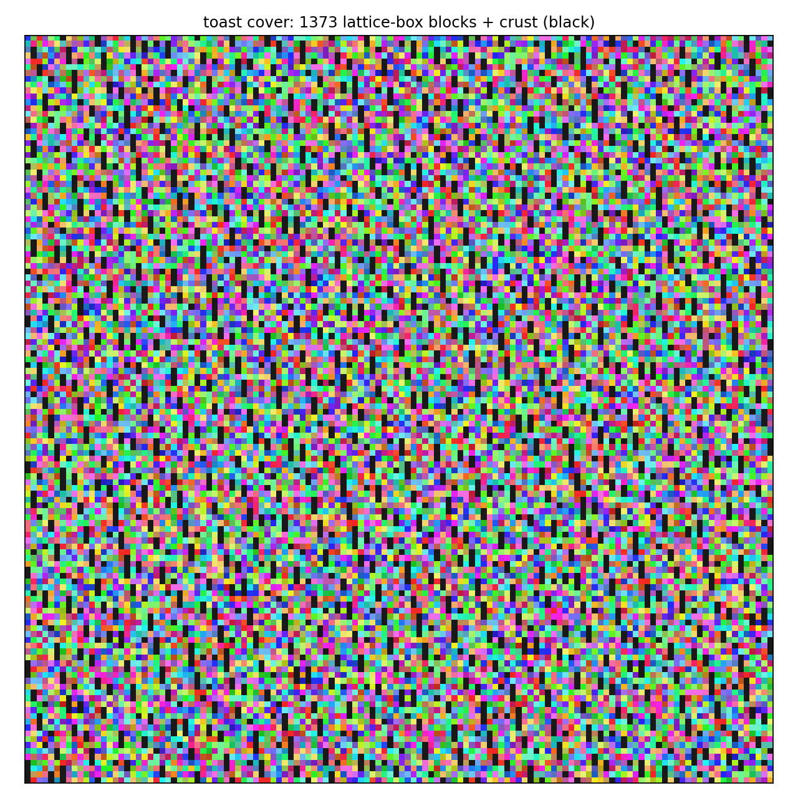

# circle-squaring

A computational demo of **Tarski's circle squaring**, modeled on the construction in
Máthé, Noel & Pikhurko, *Circle Squaring with Pieces of Small Boundary and Low Borel
Complexity* ([arXiv:2202.01412](https://arxiv.org/abs/2202.01412), Advances in
Mathematics 484, 2026).

The continuum theorem: a disk and a square of equal area are equidecomposable
**by translations alone**, with Borel pieces of positive measure whose boundaries
have upper Minkowski dimension below 2. This repo runs the same pipeline on a
discrete torus, where every step is finite and checkable, and draws the pieces.


*1600 points, 19 pieces, every piece moved by a single translation. Same color =
same piece.*


*The same decomposition sliding: each piece travels along its (single)
translation vector.*

## What it does

Working on the discrete torus `Z_N × Z_N`:

1. **Shapes** (`shapes.py`) — a `side × side` square `B`, and a "disk" `A` defined as
   the `side²` grid points nearest a center: exact area matching, the discrete
   `λ(A) = λ(B)`.
2. **Translation graph** (`graph.py`) — `d` random vectors `x_1..x_d` generating the
   graph `G_d`: `u` is adjacent to `u + Σ nᵢxᵢ` for small integer `nᵢ`. Vector sets
   that only generate a sublattice are rejected (rank 2 mod every prime dividing `N`)
   — the discrete analogue of the paper's "no rational dependencies" property (2.11).
3. **Bounded matching** (`matching.py`) — a perfect matching `A → B` along `G_d`
   edges. Two solvers: Hopcroft–Karp with escalating radius `r = 1, 2, …`
   (extending the matching at each stage), and the default **min-cost** matching
   (scipy's sparse LAPJVsp) minimizing total `1 + ‖n‖₁`, which concentrates the
   bijection on the cheapest displacements — 19 pieces vs. Hopcroft–Karp's 35 on
   the default instance. Either replaces the paper's bounded integer-valued flow
   (their Lemma 2.16 reduction); the fact that a small `r` works is the discrete
   shadow of Laczkovich's discrepancy bounds.
4. **Toast-style local rounding** (`toast.py`, `local_rounding.py`,
   `--matcher toast`) — the finite analogue of the paper's core construction:
   a local real flow by lazy diffusion of the demand, then an *online* rounding
   that commits final integer values block by block (images of small lattice
   boxes, peeled inward by distance to a reserved "crust" block that closes the
   flow exactly). No lookahead, no revision, `div g = χ` exact by assertion.
   It pays for locality in pieces — 186 vs. min-cost's 19 — the toy-scale echo
   of the paper's ~10²⁰⁰. Full write-up: [docs/toast-rounding.md](docs/toast-rounding.md).
5. **Pieces** (`pieces.py`) — matched pairs grouped by displacement: each piece is
   translated by a single vector `Σ nᵢxᵢ`. `verify()` checks the pieces partition
   the disk and their translates partition the square exactly.
6. **Render** (`viz.py`, `anim.py`) — both shapes colored by piece, plus a GIF of
   the pieces sliding along their translation vectors (smoothstep easing, shortest
   torus representative of each displacement).

## Usage

```sh
PYTHONPATH=src python3 -m circle_squaring --n 128 --side 40 --d 3 --seed 0 --out out
```

Outputs `out/pieces.png`, `out/animation.gif`, and `out/stats.json`. Typical run:
1600 points squared in ~0.1 s, 19 pieces at radius 2 with the default min-cost
matcher (`--matcher hopcroft-karp` for the flow-style escalating matcher,
`--no-gif` to skip the animation).

The paper-style pipeline runs with `--matcher toast` (plus `--rounds`,
`--block`, `--crust`), also writing `out/toast.png` — the toast cover, whose
blocks are lattice-box images and so appear as scattered constellations in
Euclidean view:



Tests:

```sh
python3 tests/test_equidecomposition.py    # or: pytest tests/
```

Requires Python ≥ 3.10, numpy, scipy, matplotlib, pillow.

## What this is *not*

Honesty section. The hard parts of the real theorem have no finite content to
simulate, and this demo does not attempt them:

- **Axiom-of-choice-free structure.** On a finite torus everything is trivially
  "Borel". The paper's achievement — pieces that are Boolean combinations of F_σ
  sets with boundaries of Minkowski dimension < 2 — lives in the continuum.
- **Meaningful locality radii.** `--matcher toast` reproduces the paper's online
  local rounding faithfully in *algorithmic* structure (commit-and-never-revise,
  local repairs, a crust closing the flow — see
  [docs/toast-rounding.md](docs/toast-rounding.md)), but at feasible N the graph
  `G_d` has diameter ~4, so "bounded radius" is trivially satisfied. The
  continuum locality statement has no finite-N content; what the demo shows
  instead is its *price* — 186 pieces where global optimization needs 19.
- **True toast separation.** Components at pairwise `G_d`-distance ≥ 3 with
  nesting (the paper's Definition 2.14) need room that only exists as N → ∞;
  the shell-peeling order in `toast.py` is a provable finite substitute, not an
  implementation of Def. 2.14. Proof walkthrough of the real thing:
  [docs/paper-notes.md](docs/paper-notes.md).

What *does* survive discretization — and is the point of the demo — is the
combinatorial core: random translation vectors make the disk and square so
evenly interleaved in `G_d` that a bounded-displacement bijection exists, and
grouping it by displacement *is* the equidecomposition.

## Layout

```
src/circle_squaring/   shapes, graph, matching, toast, local_rounding, pieces, viz, anim, CLI
tests/                 pipeline and unit tests (plain python or pytest)
docs/paper-notes.md    proof walkthrough of arXiv:2202.01412
docs/toast-rounding.md the toast matcher: design, ordering theorem, measurements
assets/example.png     committed example render
```

## References

- A. Máthé, J. A. Noel, O. Pikhurko, arXiv:2202.01412.
- M. Laczkovich, *Equidecomposability and discrepancy: a solution of Tarski's
  circle-squaring problem*, Crelle 404 (1990).
- A. Marks, S. Unger, *Borel circle squaring*, Annals of Mathematics 186 (2017).
- Quanta Magazine, [*An Ancient Geometry Problem Falls to New Mathematical
  Techniques*](https://www.quantamagazine.org/an-ancient-geometry-problem-falls-to-new-mathematical-techniques-20220208/) (2022).
